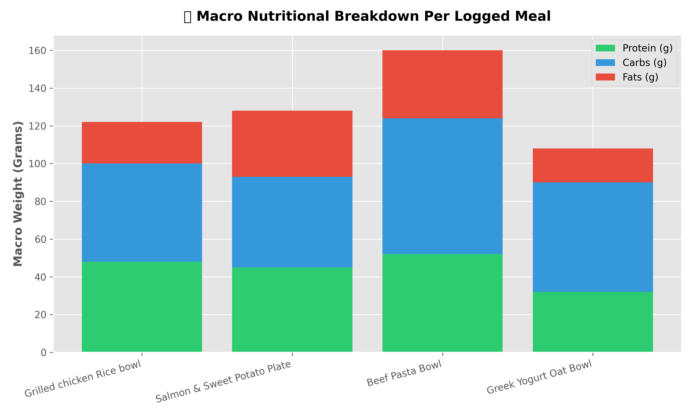

# 🟢 Production-Grade Nutrition Pipeline & ML Analytics Engine

An end-to-end data engineering and data science pipeline that manages, tracks, aggregates, and runs machine learning predictions on daily nutritional macro datasets. 

This multi-stage system transitions from basic local data tracking to an interactive, full-stack workflow utilizing relational database engines, exploratory data analysis frameworks, and predictive intelligence modeling.

---

## 📈 System Architecture & Visual Analytics
The system includes a dedicated visual analytics layer (`dashboard.py`) built on Matplotlib. It extracts historical records directly from the SQL server and generates statistical visualizations tracking multi-dimensional macronutrient distribution profiles.



---

## 🚀 Technical Core Pipeline Features

### 1. Data Engineering Layer (`tracker.py`)
* **Secure Environment Configurations:** Implements the `python-dotenv` framework to read database infrastructure credentials securely via local system environments (`.env`), completely mitigating public security exposures.
* **Relational Database Storage:** Connected to an active architecture using a native MySQL engine connector, executing clean atomic `INSERT` and `SELECT` operations.
* **Interactive CLI Interface:** Implements continuous processing loops coupled with data-validation error handling routines to guarantee data integrity during application runtime.

### 2. Data Manipulation Layer (`analysis.py`)
* **Pandas DataFrame Transformation:** Extracts raw transactional SQL entries directly from the database and maps them into optimized data structures for rapid data wrangling.
* **Boolean Data Filtering:** Leverages vector masks to instantly filter rows matching high-density macro properties (e.g., separating target muscle-building entries).
* **Time-Series Aggregation:** Utilizes a custom `groupby()` matrix operation to collapse micro-meal layers into complete historical daily performance datasets.

### 3. Machine Learning Layer (`ml_pipeline.py`)
* **Algorithmic Weight Extraction:** Fits a Scikit-Learn `Linear Regression` model to historical dataset rows to independently deduce the hidden biological coefficients relating macro inputs to target calorie counts.
* **Coefficient Accuracy Evaluation:** Successfully extracts close approximations of biological constants (1g Protein ≈ 4 kcal, 1g Carbs ≈ 4 kcal, 1g Fat ≈ 9 kcal) without explicitly programming the baseline equation rules.
* **Predictive Testing Pipeline:** Constructs isolated testing matrices to forecast calorie targets for hypothetical nutritional profiles.

---

## 🛠️ Technology Stack & Dependencies
* **Core Language:** Python 3.13
* **Database Management:** MySQL Server, MySQL Workbench
* **Data Science Libraries:** Pandas, Matplotlib, Scikit-Learn

---

## 💻 Local Ingestion Instructions

1. **Verify your local MySQL Server is actively running.**
2. **Configure your secure credentials inside a local `.env` file:**
   ```text
   DB_PASSWORD=your_secure_workbench_password